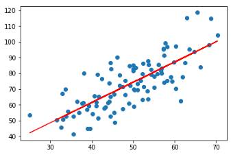

# Car Sales Prediction
 Code to predict car purchasing dollar amount using ANNs and Keras. A typical problem of regression.
 
 > Python, Sklearn, Pandas and Keras
 
 # Regression Problems
Regression models are used to predict a continuous value. Predicting prices of a house given the features of house like size, price etc, or predicting car purchase amount based on other features is one of the common examples of Regression. It is a supervised technique. Below we can see an example of linear regression results, where de red line is the predict values...

   

## Features
Here are all the features loaded by csv file before cleaning steps:
* Customer Name
* Customer E-mail
* Country
* Gender
* Age
* Anual Salary
* Credit Card Debt
* Net Worth
* Car Purchase Amount

# Steps to build Regressor
We can resume the steps into:
- Import libraries
- Importa dataset
- Visualize dataset
- Cleaning
- Create training and test dataset
- Training the model
- Evaluating the model to new data
